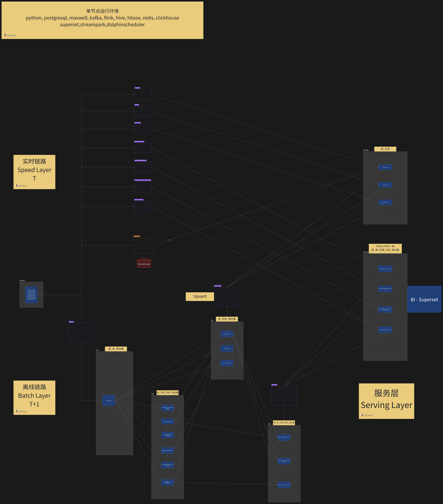
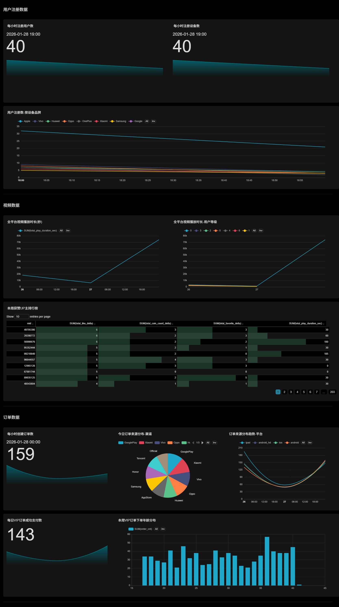
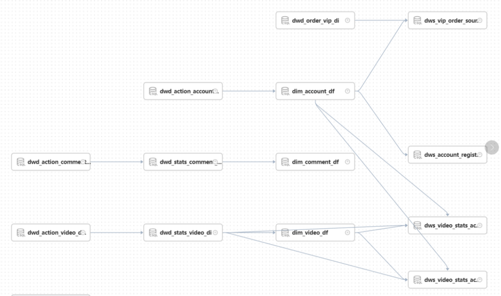

## 简易视频平台数据仓库

#### 特点：

1. 整合维表，提供实体信息的单点查询能力
2. 进行多表关联，提供面向主题的分析能力
3. 实现离线、实时链路合并，搭建实时看板

#### 数据链路架构图飞书云文档：

https://y1hmnem2vtl.feishu.cn/docx/C4Hfddk9MoCSY4xxdVTcaR2Pnsh?openbrd=1&doc_app_id=501&blockId=doxcnUUICwp6ysqHSfXZppon4Nf&blockType=whiteboard&blockToken=MqnGwDFC3ho8mqboOKOc3wNCnfn#doxcnUUICwp6ysqHSfXZppon4Nf

#### 看板预览：

#### DolphinScheduler调度作业依赖图：

